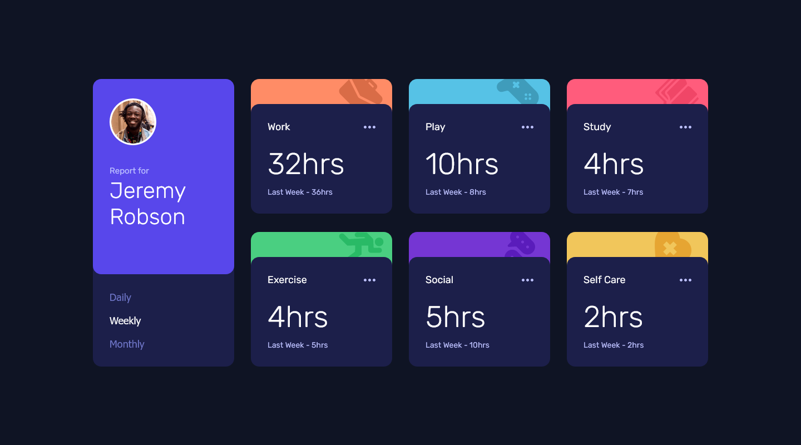

# Time Tracking Dashboard

## Challenge

This component should:
- Allow the user to switch between viewing Daily, Weekly, and Monthly stats
- Show hover states for all interactive elements 
- Respond to the device's screen size

### Links
- [Solution](https://www.frontendmentor.io/solutions/time-tracking-dashboard-using-react-mpH8sYf8lN)
- [Live Site](https://relaxed-gelato-13dfff.netlify.app/)

### Built with
- React JS & JSX
- CSS custom properties
- Flexbox
- CSS Grid
- Desktop-first workflow

## Author

- Frontend Mentor [@Isaiah-B](https://www.frontendmentor.io/profile/Isaiah-B)
